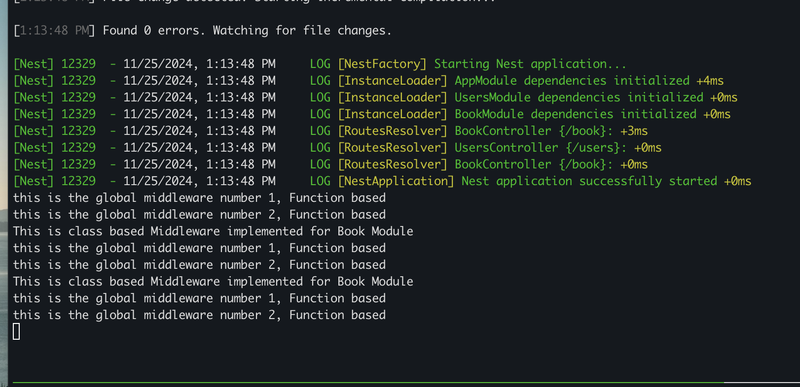

Types of Middleware - 
1. Module Based -  each module has a separate Middleware 
2. Global Middleware - only one Middleware globally

Methods of creating Middleware - 

There can be Multiple Middlewares - 

POINTS TO REMEMBER :- 
1. To create global middleware we need to use Function based middleware and it needs to declared in the main.ts

2. Middleware consumer
The MiddlewareConsumer is a helper class. It provides several built-in methods to manage middleware. All of them can be simply chained in the fluent style. The forRoutes() method can take a single string, multiple strings, a RouteInfo object, a controller class and even multiple controller classes. In most cases you'll probably just pass a list of controllers separated by commas

3. Excluding routes in middleware
At times we want to exclude certain routes from having the middleware applied. We can easily exclude certain routes with the exclude() method. This method can take a single string, multiple strings, or a RouteInfo object identifying routes to be excluded. The exclude() method supports wildcard parameters using the path-to-regexp package.